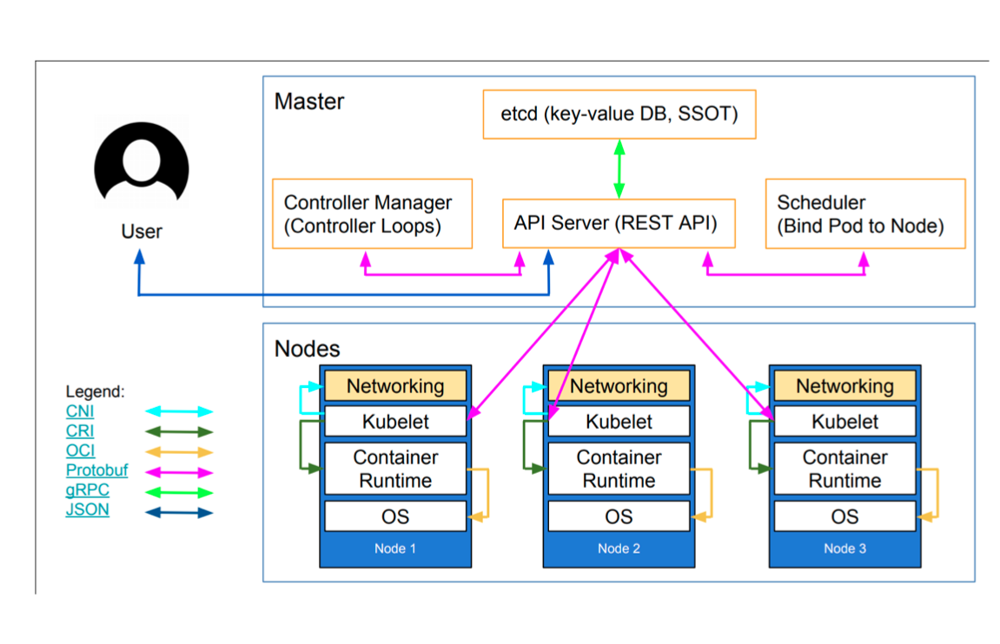
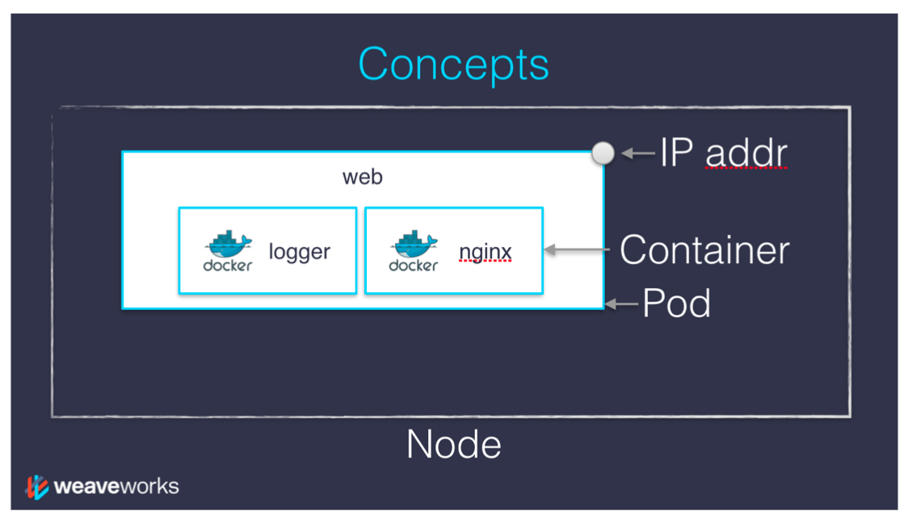

## Kubernetes architecture:

Together, these services form the control plane of our cluster ( the control plane is also called the __master__)
The Kubernetes logic (its "brains") is a collection of service:
 
 * the __API server__ (our point of entry to everything!)
 
 * core services like the __scheduler__ and __controller manager__
 
 * __etcd__ ( a highly avaliable key/value store; the "database" of Kubernetes )
 
 

## Pods in Kubernetes

### Pod is mortal

However, applications in different Pods	are isolated from each other;they have different IP addresses, different hostnames, and	more. Containers in ifferent Pods running on the same node might as well be on different servers.

**Multiple Pods can be placed on the same machine as long as there are sufficient resources.**	



Multiple instances of a	Pod can	be deployed by repeating the workflow described	here. However,	ReplicaSet are better suited for running multiple instances of a Pod.

``` $ kubectl apply -f kuard-pod.yaml```

The Pod	manifest will be submitted to the Kubernetes API server.The Kubernetes system will then	schedule that Pod to run on a **healthy node** in the cluster, where it	will be	monitored by the  kubelet daemon process.

#### Using Port Forwarding

``` $ kubectl port-forward kuard 8080:8080 ```

If your cluster in the cloud sameplace, you can use SSh tunneling with something like this:

	ssh <kube node> -L 8081:localhost:8080 
	
	curl localhost:8081


#### Getting more info with Logs

``` $ kubectl logs kuard ```

Adding the  --previous 	flag will get logs from	a previous instance of the container. This is useful, for example, if your containers are continuously restarting due to a problem at container startup.


## Healthchecks

### Liveness and Readiness Probe

**_Liveness_** probes are defined per container, which means each container inside a Pod is health-checked separately.

Kubernetes makes a distinction between **_liveness_** and **_readiness_**.

Containers that	fail liveness checks is killed and are restarted (depends on the pod's __restartPolicy__ Never, OnFailure, Always ). 
Readiness describes when a container	is ready to serve user requests and traffic.
Containers that	fail readinesschecks are removed from service load balancers __not killed__.	

#### Different types of probes
 * HTTP request
   * any status code between 200 and 399 indicates success
 * TCP connection
   * the probe the TCP port is open
 * arbitrary exec
   * a command is executed in the container
   * exit code zero is success
   
   	
## Resource	Management

**Resource Requests**:	Minimum	Required	Resources

Resources are requested per container, not per Pod. The total resources requested by the Pod is the sum of all resources requested by all containers in the Pod.The reason for this is that in many cases the different containers have very different CPU requirements.	

**The Kubernetes scheduler will ensure	that the sum of all requests of all Pods on a node does not exceed the capacity of the node.**

## Service

Services can be exposed in different ways by specifying a ```type``` in the ServiceSpec:

   * _ClusterIP_ (default) - Exposes the Service on an internal IP in the cluster. This type makes the Service only reachable from within the cluster.
   * _NodePort_ - Exposes the Service on the same port of each selected Node in the cluster using NAT. Makes a Service accessible from outside the cluster using ```<NodeIP>:<NodePort>```. Superset of ClusterIP.
   * _LoadBalancer_ - Creates an external load balancer in the current cloud (if supported) and assigns a fixed, external IP to the Service. Superset of NodePort.
   * _ExternalName_ - Exposes the Service using an arbitrary name (specified by ```externalName``` in the spec) by returning a CNAME record with the name. No proxy is used. This type requires v1.7 or higher of ```kube-dns```.

```
kubectl edit service rng
```

## LABELS

###### $ kubectl get po --show-labels

###### $ kubectl get po -l run=kuard
	or
###### $ kubectl get po --selector="run=kuard,ver=2"

###### $ kubectlget pods --selector="app in (alpaca,bandicoot)"

###### $ kubectl get deployments --selector="canary" { all deployment with canary label }

## Adding labels to pods

```
kubectl label pods -l app=rng enabled=yes
```

#### Update the service to add ```enabled: yes``` to its selector:
```
kubectl edit service rng
```

## Endpoint

###### $ kubectl describe endpoints alpaca-prod

###### $ kubectl get endpoints alpaca-prod --watch

## Replica Set

###### $ kubectl get pods -l app=kuard,version=2 { finding a set of Pods for replica set}

###### $ kubectl scale kuard --replicas=4 { scale up to four replicas }
 
###### $ kubectl autoscale rs kuard --min=2 --max=5 --cpu-percent=80 { scale base on CPU }

###### $ kubectl get hpa { horizonttal pod autoscaling }

###### $ kubectl delete	rs kuard --cascade=false  { delete th Podsthat are being managed by the ReplicaSet, not the Pod }

## Jobs:	

Run Jobs useing cli

$	kubectl	run	-i	oneshot	\
	--image=gcr.io/kuar-demo/kuard-amd64:1	\
	--restart=OnFailure	\
	--	--keygen-enable	\
		--keygen-exit-on-complete	\
		--keygen-num-to-gen	10

There are some things to note here:
 * the	 **-i**  option to  kubectl indicates that this	is an interactive command. kubectl  will wait until the Job is running	and then show the log output from the first (and in this case only) pod	in the Job.

 * **--restart=OnFailure** 	is the option that tells kubectl  to create a Job object. 

 * All of the options after  **--** are command-line arguments to the container image. These instruct our test server ( kuard ) to generate	10 4,096-bit SSH keys and then	exit.

 * Your	output may not match this exactly.  kubectl often misses the first couple of lines of output with the  -i option.

## Network Policies

Kubernetes network policies specify how pods can communicate with other pods and with external endpoints. 

The following network traffic is allowed by default:

    A pod accepts external traffic from any IP address to its NodePort or LoadBalancer service or its Ingress resource.
    A pod accepts internal traffic from any other pod in the same cluster.
    A pod is allowed outbound traffic to any IP address.

A network policy is defined by the following things:

  * A _pod selector_ indicating which pods it applies to
  
  * A list of _ingress rules_ indicating which inbound traffic is allowed
  
  * A list of egress rules indicating which outvound traffic is allowed

Network policies let you create additional restrictions on what traffic is allowed. For example you may want to restrict external inbound or outbound traffic to certain IP addresses.

```
$ kubectl run -i --tty --rm busybox --image=busybox -- sh

If you don't see a command prompt, try pressing enter.

/ # nc -v -z 172.30.108.139 6379
172.30.108.139 (172.30.108.139:6379) open

/ # nc -v -z 172.30.108.140 6379
172.30.108.140 (172.30.108.140:6379) open

/ # nc -v -z 172.30.58.206 6379
172.30.58.206 (172.30.58.206:6379) open

/ # exit
Session ended, resume using 'kubectl attach busybox-5858cc4697-hb6zs -c busybox -i -t' command when the pod is running
deployment.apps "busybox" deleted
```

## Authentication and authorization in Kubernetes

  * **Authentication** verifying the identity of a person

    On a UNIX system, we can authenticate with login+password, SSH keys ...

  * **Authorization**  listing what they are allowed to do

    On a UNIX system, this can include file permissions, sudoer entries ...

Sometimes abbreviated as __"authn"__ and __"authz"__

### When the API server receives every request, it tries to authenticate it

### Authentication methods

* TLS client certificates

  (that's what we've been doing with kubectl so far)

* Bearer tokens

  (a secret token in the HTTP headers of the request)

* HTTP basic auth

  (carrying user and password in an HTTP header)

* Authentication proxy

  (sitting in front of the API and setting trusted headers)

```
kubectl config view \
      --raw \
      -o json \
      | jq -r .users[0].user[\"client-certificate-data\"] \
      | openssl base64 -d -A \
      | openssl x509 -text \
      | grep Subject:

```

#### Authentication with tokens

Tokens can be validated through a number of different methods:
 * static tokens hard-coded in a file on the API server

 * bootstrap tokens (special case to create a cluster or join nodes)

 * OpenID Connect tokens (to delegate authentication to compatible OAuth2 providers)

 * service accounts 

Finding the secret
```
kubectl get sa default -o yaml
SECRET=$(kubectl get sa default -o json | jq -r .secrets[0].name)
```
Extracting the token
```
kubectl get secret $SECRET -o yaml
TOKEN=$(kubectl get secret $SECRET -o json \
      | jq -r .data.token | openssl base64 -d -A)
```

#### Authorization in Kubernetes

There are multiple ways to grant permissions in Kubernetes, called authorizers:

 * **Node Authorization** used internally by kubelet; we can ignore it

 * **Attribute-based access control** powerful but complex and static; ignore it too

 * **Webhook** each API request is submitted to an external service for approval

 * **RBAC Role-based access control** associates permissions to users dynamically
 
 #### Testing permission
 ```
 kubectl auth can-i create pod
 
 kubectl auth can-i '*' services
 ```
