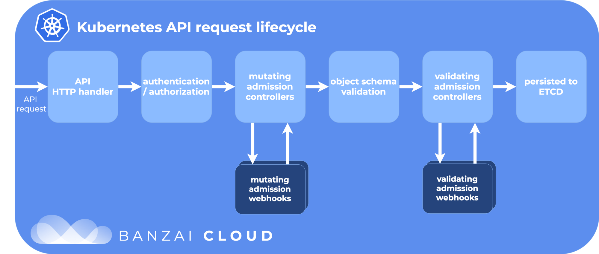

---
## Kubernetes pod can be associated with a service account

### Admission controllers

- When a Pod is created, it is associated with a ServiceAccount

  (even if we did not specify one explicitly)

- That ServiceAccount was added on the fly by an *admission controller*

  (specifically, a *mutating admission controller*)

- Admission controllers sit on the API request path

  (see the cool diagram on next slide, courtesy of Banzai Cloud)




by default, it is associated with the default service account

The associated token is exposed to the pod's filesystem

__/var/run/secrets/kubernetes.io/serviceaccount/token__

Standard Kubernetes tooling (like kubectl) will look for it there
So Kubernetes tools running in a pod will automatically use the service account

Create the new service account: 
``` kubectl create serviceaccount viewer``` 

Binding a role to the service account
``` 
kubectl create rolebinding viewercanview \
      --clusterrole=view \
      --serviceaccount=default:viewer
``` 

Run pod with serviceaccount

```
kubectl run eyepod --rm -ti --restart=Never \
      --serviceaccount=viewer \
      --image alpine
```

Install **kubectl**
```
apk add --no-cache curl
URLBASE=https://storage.googleapis.com/kubernetes-release/release
KUBEVER=$(curl -s $URLBASE/stable.txt)
curl -LO $URLBASE/$KUBEVER/bin/linux/amd64/kubectl
chmod +x kubectl
```

Testing ``` ./kubectl get all```

Check for permission with **kubectl auth can-i**:
```
kubectl auth can-i list nodes
kubectl auth can-i create pods
kubectl auth can-i get pod/name-of-pod
kubectl auth can-i get /url-fragment-of-api-request/
kubectl auth can-i '*' services

as other user:

kubectl auth can-i list nodes \
      --as some-user
kubectl auth can-i list nodes \
      --as system:serviceaccount:<namespace>:<name-of-service-account
      
```


