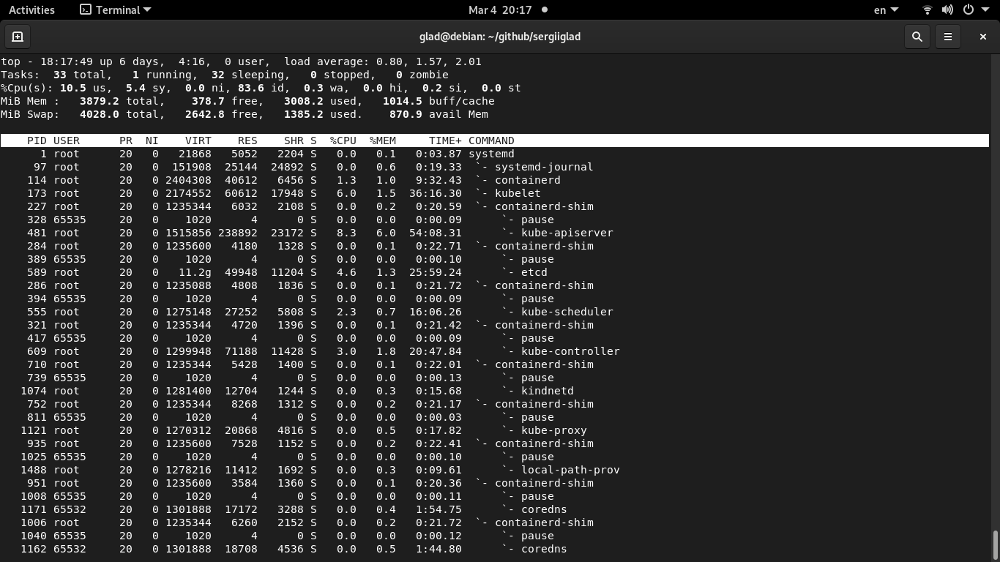
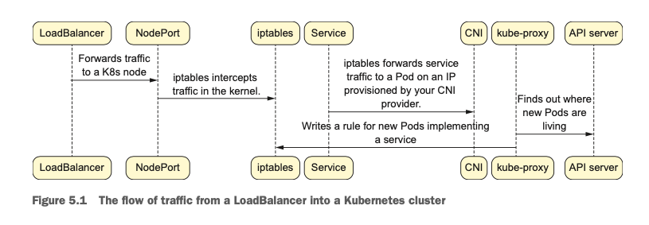

CORE KUBERNETES

https://github.com/jayunit100/k8sprototypes


after installing **kind**

image kind

https://github.com/kubernetes-sigs/kind/blob/main/images/base/Dockerfile

```bash
kubectl get po -A

NAMESPACE NAME                                         READY   STATUS    RESTARTS       AGE
kube-system          coredns-7d764666f9-2jvjv                     1/1     Running   2 (6d4h ago)   8d
kube-system          coredns-7d764666f9-zndbg                     1/1     Running   2 (6d4h ago)   8d
kube-system          etcd-kind-control-plane                      1/1     Running   2 (6d4h ago)   8d
kube-system          kindnet-hm5k6                                1/1     Running   2 (6d4h ago)   8d
kube-system          kube-apiserver-kind-control-plane            1/1     Running   2 (6d4h ago)   8d
kube-system          kube-controller-manager-kind-control-plane   1/1     Running   2 (6d4h ago)   8d
kube-system          kube-proxy-pbcq9                             1/1     Running   2 (6d4h ago)   8d
kube-system          kube-scheduler-kind-control-plane            1/1     Running   2 (6d4h ago)   8d
local-path-storage   local-path-provisioner-67b8995b4b-l6jl7      1/1     Running   4 (6d4h ago)   8d

```

```bash
docker ps


CONTAINER ID   IMAGE                  COMMAND                  CREATED      STATUS      PORTS                       NAMES
05b7a19a2259   kindest/node:v1.35.0   "/usr/local/bin/entr…"   8 days ago   Up 6 days   127.0.0.1:41451->6443/tcp   kind-control-plane

```

```bash
docker exec -ti kind-control-plane sh
ps aux
```


linux tools for running Kubernetes
* swapoff
* iptables
* mount
* systemd
* socat (kubectl port-forward)
* nsenter
* unshare
* ps (kubelet keeps eye on processes)

The most popular CRI is containerd

```bash
kubectl get pods -o=jsonpath='{.items[0].status.phase}'
```

## Building a Pod from scratch

**chroot** - the prupose is to create a container in the distilled sense.
**unshare** - isolated with a truly disengaged process space.
unshare -n for network isolation
**cgroups** - CPU and Memory limits
Kubernetes flag --cgroup-driver
typically we use systemd as the Linux driver

## Kubernetes services

### kube-proxy

kube-proxy configure iptables to do low-level network routing

The ability to track ongoing TCP connection in Linux, this is done with the **conntrack** module, a part of the Linux kernel

`iptables-save` show info

### kube-dns

### Storage
Kubernetes StorageClasses
PersistentVolumes
PersistentVolumeClaims

Scheduling is a generic problem in computer science
https://developer.hashicorp.com/nomad solve this problem

https://www.kernel.org/doc/Documentation/cgroup-v1/cgroups.txt

kubectl get nodes -o yaml
```
    allocatable:
      cpu: "2"
      ephemeral-storage: 51290592Ki
      hugepages-2Mi: "0"
      memory: 3972312Ki
      pods: "110"
```

cat /var/lib/kubelet/config.yaml | grep swap

## QoS classes

Burstable, Guaranteed и BestEffort are the three QoS classes

## Monitoring the Linux kernel with Prometheus,cAdvisor, and the API server

A metric is a quantifiable value of some sort

There are three fundamental types of metrics that we'll concern ourselves with - histograms, gauges and cunters

* __Gauges__: Indicate how many requests you get per second at any given time.
* __Histograms__: Show bins of timing for different types of events (e.g., how many
requests completed in under 500 ms).
* __Counters__: Specify continuously increasing counts of events (e.g., how many total requests you’ve seen).

run Prometheus in docker
```
docker run -p 9090:9090 \
  -v $(pwd)/prometheus.yml:/etc/prometheus/prometheus.yml \
  -v prometheus-data:/prometheus \
     prom/prometheus:latest-distroless \
        --config.file=/etc/prometheus/prometheus.yml \
        --storage.tsdb.path=/prometheus \
        --storage.tsdb.retention.size=5GB
```

Expose api server locally
```
kubectl proxy --address='172.18.0.1' --port=8001 --accept-hosts='.*'
```

There are three primary types of Kubernetes Service API objects that we can create:
* ClusterIPs, 
* NodePorts, and 
* LoadBalancers

The **kube-proxy** uses a low-level routing technology like iptables or IPVS to send traffic from services into and out of Pods.


