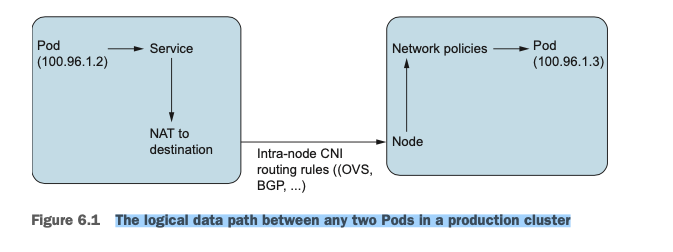
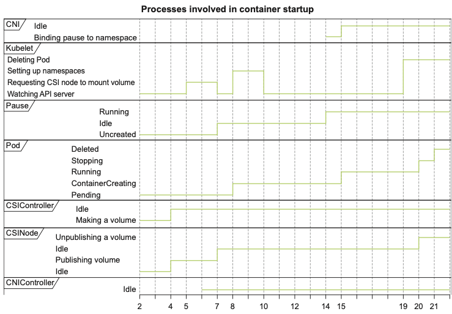

CORE KUBERNETES

https://github.com/jayunit100/k8sprototypes


after installing **kind**

image kind

https://github.com/kubernetes-sigs/kind/blob/main/images/base/Dockerfile

```bash
kubectl get po -A

NAMESPACE NAME                                         READY   STATUS    RESTARTS       AGE
kube-system          coredns-7d764666f9-2jvjv                     1/1     Running   2 (6d4h ago)   8d
kube-system          coredns-7d764666f9-zndbg                     1/1     Running   2 (6d4h ago)   8d
kube-system          etcd-kind-control-plane                      1/1     Running   2 (6d4h ago)   8d
kube-system          kindnet-hm5k6                                1/1     Running   2 (6d4h ago)   8d
kube-system          kube-apiserver-kind-control-plane            1/1     Running   2 (6d4h ago)   8d
kube-system          kube-controller-manager-kind-control-plane   1/1     Running   2 (6d4h ago)   8d
kube-system          kube-proxy-pbcq9                             1/1     Running   2 (6d4h ago)   8d
kube-system          kube-scheduler-kind-control-plane            1/1     Running   2 (6d4h ago)   8d
local-path-storage   local-path-provisioner-67b8995b4b-l6jl7      1/1     Running   4 (6d4h ago)   8d

```

```bash
docker ps


CONTAINER ID   IMAGE                  COMMAND                  CREATED      STATUS      PORTS                       NAMES
05b7a19a2259   kindest/node:v1.35.0   "/usr/local/bin/entr…"   8 days ago   Up 6 days   127.0.0.1:41451->6443/tcp   kind-control-plane

```

```bash
docker exec -ti kind-control-plane sh
ps aux
```


linux tools for running Kubernetes
* swapoff
* iptables
* mount
* systemd
* socat (kubectl port-forward)
* nsenter
* unshare
* ps (kubelet keeps eye on processes)

The most popular CRI is containerd

```bash
kubectl get pods -o=jsonpath='{.items[0].status.phase}'
```

## Building a Pod from scratch

**chroot** - the prupose is to create a container in the distilled sense.
**unshare** - isolated with a truly disengaged process space.
unshare -n for network isolation
**cgroups** - CPU and Memory limits
Kubernetes flag --cgroup-driver
typically we use systemd as the Linux driver

## Kubernetes services

### kube-proxy

kube-proxy configure iptables to do low-level network routing

The ability to track ongoing TCP connection in Linux, this is done with the **conntrack** module, a part of the Linux kernel

`iptables-save` show info

### kube-dns

### Storage
Kubernetes StorageClasses
PersistentVolumes
PersistentVolumeClaims

Scheduling is a generic problem in computer science
https://developer.hashicorp.com/nomad solve this problem

https://www.kernel.org/doc/Documentation/cgroup-v1/cgroups.txt

kubectl get nodes -o yaml
```
    allocatable:
      cpu: "2"
      ephemeral-storage: 51290592Ki
      hugepages-2Mi: "0"
      memory: 3972312Ki
      pods: "110"
```

cat /var/lib/kubelet/config.yaml | grep swap

## QoS classes

Burstable, Guaranteed и BestEffort are the three QoS classes

## Monitoring the Linux kernel with Prometheus,cAdvisor, and the API server

A metric is a quantifiable value of some sort

There are three fundamental types of metrics that we'll concern ourselves with - histograms, gauges and cunters

* __Gauges__: Indicate how many requests you get per second at any given time.
* __Histograms__: Show bins of timing for different types of events (e.g., how many
requests completed in under 500 ms).
* __Counters__: Specify continuously increasing counts of events (e.g., how many total requests you’ve seen).

run Prometheus in docker
```
docker run -p 9090:9090 \
  -v $(pwd)/prometheus.yml:/etc/prometheus/prometheus.yml \
  -v prometheus-data:/prometheus \
     prom/prometheus:latest-distroless \
        --config.file=/etc/prometheus/prometheus.yml \
        --storage.tsdb.path=/prometheus \
        --storage.tsdb.retention.size=5GB
```

Expose api server locally
```
kubectl proxy --address='172.18.0.1' --port=8001 --accept-hosts='.*'
```

There are three primary types of Kubernetes Service API objects that we can create:
* ClusterIPs, 
* NodePorts, and 
* LoadBalancers

The **kube-proxy** uses a low-level routing technology like iptables or IPVS to send traffic from services into and out of Pods.


looking at **kube-proxy** mode field: 
```bash
kubectl edit cm kube-proxy -n kube-system
```

#### CNI

The CNI specification doesn’t specify the details of container networking
The CNI specification is a generic definition for the high-level operations to add a container to a network.

**CNI providers** implement the CNI specification (http://mng.bz/RENK), which defines a contract that allows container runtimes to request a working IP address for a process on startup. They also add other fancy features outside this specification (like implementing network policies or third-party network monitoring integrations).

CNI Providers:
* Calico
* Antrea
* Flannel
* Weave
* Google, EC2, and NCP
* Cilium
* KindNet

End users won’t generally notice this difference, but it’s an important distinction to administrators because some administrators might want to use Layer 3 concepts (like BGP peering) or Layer 2 concepts (like OVS-based traffic monitoring) for broader infrastructure design goals in their clusters:
* BGP stands for Border Gateway Protocol, which is a Layer 3 routing technology
used commonly in the overall internet
* OVS stands for Open vSwitch, which is a Linux kernel-based API for program-ming a switch inside your OS to create virtual IP addresses

We looked at the DaemonSet functionality as an interface that both
Calico and Antrea implement.

OVS is what Antrea uses to power its CNI capabilities. Unlike BGP, it doesn’t use an IP address as the mechanism for routing directly from node to node as we saw with Calico. But, rather, it creates a bridge that runs locally on our Kubernetes node. This bridge is created using OVS.

## Troubleshooting large-scale network errors

**Sonobuoy**: A tool for confirming your cluster is functioning

The logical data path between any two Pods in a production cluster


The data path does not take into account several caveats that can go wrong. For example, in the real world
* The first Pod can also be subject to network policy rules.
* There may be a firewall at the interface between nodes 10.1.2.3 and 10.1.2.4.
* The CNI may be down or malfunctioning, meaning that the routing of the
packet between nodes might go to the wrong place.
* Often, in the real world, a Pod’s access to other Pods might require mTLS (mutual TLS) certificates.

#### Checks
How many packets are flowing through the network interfaces for our CNI?
```bash
ip -s link
```
Routes
```bash
route -n
```
Thus, we can see that:
* Antrea has one routing table entry per node.
* Calico has one routing table entry per Pod.

CNI-specific tooling: Open vSwitch (OVS)
Once we start getting into the internals of CNIs, we will need to actually look at tools such as 
* ovs-vsctl,
* antctl,
* calicoctl, 

Tracing the data path of active containers with **tcpdump**

>The most important thing to remember about the **kube-proxy** is that its operations are, generally speaking, independent of the operations of your CNI provider. 

#### The kube-proxy and iptables
```bash
iptables-save
```

with tools such as ```diff```, it can be used to measure the delta

**Ingress** rules and **NetworkPolicies**
> are two of the sharpest features of Kubernetes networking, largely because these are both defined by the API but implemented by external services that are considered optional in a cluster. 

### Network policy 
NetworkPolicies in Kubernetes support blocking traffic for ingress/egress calls or
both on any Pod.

NetworkPolicies are created in a specific namespace and target Pods by label.
* NetworkPolicies must define a type (ingress is the default).
* NetworkPolicies are additive and are allow-only, meaning that they deny things
by default and can be layered to allow more and more traffic whitelisting
* Both Calico and Antrea implement the Kubernetes NetworkPolicy API differently. Calico creates new iptables rules, whereas Antrea creates OVS rules.
* Some CNIs, like Flannel, don’t implement the NetworkPolicy API at all.
* Some CNIs, like Cillium and OVN, (Open Virtual Network) Kubernetes, don’t implement the entire Kubernetes API’s NetworkPolicy specification (for example, Cillium doesn’t implement the recently added PortRange policy, which is Beta at the time of this publication, and OVN Kubernetes doesn’t implement the NamedPort functionality).

Defining these sorts of YAML policies can be very painstaking
https://github.com/ahmetb/kubernetes-network-policy-recipes/

>Remember, both OVS and iptables are integrated within the Linux kernel, so you don’t have to do anything special to your data center in order to use these technologies. 

[Install Calico CNI](https://docs.tigera.io/calico/latest/getting-started/kubernetes/kind)


## Ingress

Ingress controllers allow you to route all traffic to your cluster 
through a single IP address (and are a great way to save money on cloud IP addresses). 

The purpose of ingress controllers is to provide named access to the outside world for the myriad of Kubernetes services you’ll run.

# Pos storage and the CSI

**Do Pods retain state?**
>In short, the answer is no. Don’t forget that a Pod is an ephemeral construct in almost all cases. In some cases (for example, with a StatefulSet) some aspects of a Pod (such as the IP address or, potentially, a locally mounted host volume directory) might persist between restarts. If a Pod dies for any reason, it will be recreated by a process in the Kubernetes controller manager (KCM). When new Pods are created, it is the Kubernetes scheduler’s job to make sure that a given Pod lands on a node capable of running it. Hence, the ephemeral nature of Pod storage that allows this real-time decision making is integral to the flexibility of managing large fleets of applications.

Types of storage that typically cause problems in Kubernetes environments:

* Docker/containerd/CRI storage - the copy-on-write filesystem that runs your con-
tainers. Typically, the Kubernetes environment uses a filesystem such as btrfs, overlay, or
overlay2
* Kubernetes infrastructure storage — The hostPath or Secret volumes
* Application storage — The storage volumes that Pods use in a Kubernetes cluster. Common storage volume filesystems are OpenEBS, NFS, GCE, EC2 and vSphere persistent disks, and so on.

Storage:
* The **PV PersistentVolume** is created by a dynamic storage provisioner that runs on our kind clus-
ter. This is a container that provides Pods with storage by fulfilling PVCs on
demand.
* The **PVC PersistentVolumeClaim** will not be available until the PersistentVolume is ready because the
scheduler needs to ensure that it can mount storage into the Pod’s namespace
before starting it.
* The kubelet will not start the Pod until the VFS has successfully mounted the
PVC into the Pod’s filesystem namespace as a writable storage location.

Once we realize that Pods can have many different types of storage, it becomes clear
that we need a pluggable storage provider for Kubernetes. That is the purpose of the
[CSI interface](https://kubernetes-csi.github.io/docs/).



CSI spec is available at [link](https://github.com/container-storage-interface/spec?tab=readme-ov-file)

Many applications that areadministrative in nature use this feature **hostPath**, including
* Prometheus, a metrics and monitoring solution, for mounting /proc and other
system resources to check resource usage
* Logstash, a logging integration solution, for mounting various logging directo-
ries into containers
* CNI providers that, as mentioned, self-install binaries into /opt/cni/bin
* CSI providers, which use hostPaths to mount vendor-specific utilities for storage

***Timothy St. Claire, an early Kubernetes maintainer and contributor***

The concept behind a **StatefulSet** is that a Pod is continually recreated on the same node. In this case, rather than simply having a volume definition, we have a **VolumeClaimTemplate**. This template is named differently for each volume.
